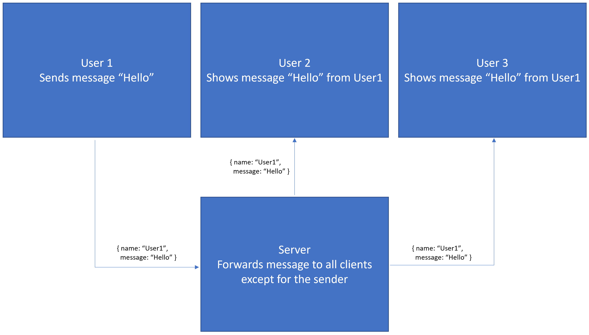

# Chat App
A chat app for the Pyxis Hacks II Hackathon

## How It Works
The server is build with express.js and socket.io, and the client is built with React and socket.io. When a users views the website, they are viewing the react app. When they send a message, socket.io sends the message to the server, which gets sent to all the other clients. This gives the effect of everyone seeing the message the user sent.\
 

## Features
Right now the Chat App is in its very early features. The only feature is not putting the name again if the previous message is by the same person.
